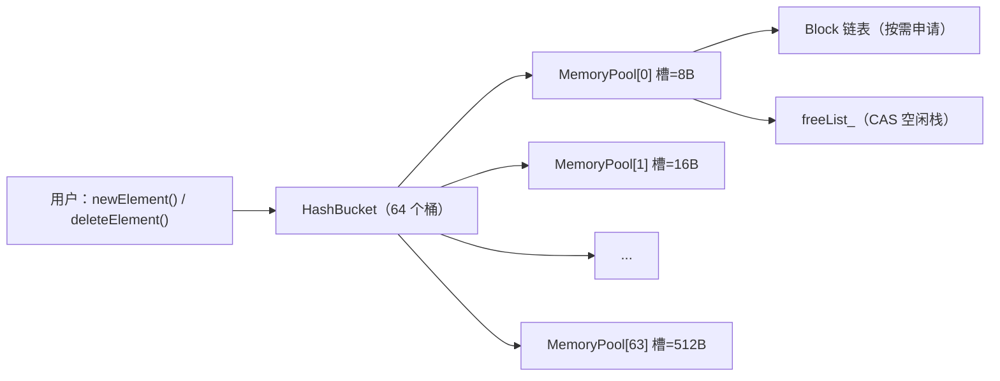
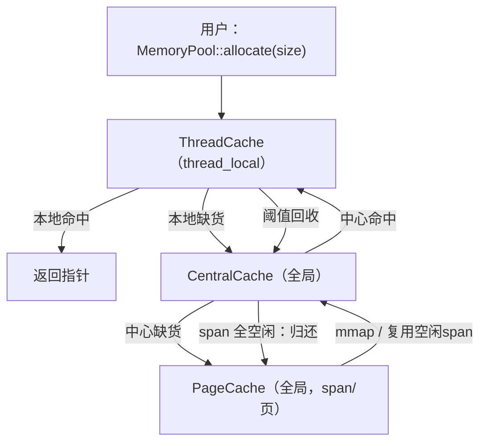

## MemoryPool：从 v1 到 v2 的内存池实现

这个仓库包含两个可独立编译运行的 C++ 内存池版本：

- **v1**：固定大小的小对象池（8~512B，步长 8B），用 **64 个 `MemoryPool`** 管理不同槽大小；大于 512B 直接走系统分配。
- **v2**：在 v1 思路上升级为 **ThreadCache / CentralCache / PageCache** 三层缓存架构，覆盖 **8B 对齐 ~ 256KB** 的小/中对象；更贴近生产级分配器的路径。

> 目标是：把“内存池为什么快、怎么做出来、怎么验证”这三件事讲清楚，并提供可直接运行的单测与性能测试。

---

## 目录结构

```text
.
├── v1
│   ├── include/MemoryPool.h
│   ├── src/MemoryPool.cpp
│   ├── tests/UnitTest.cpp
│   └── CMakeLists.txt
└── v2
    ├── include/
    │   ├── Common.h
    │   ├── MemoryPool.h
    │   ├── ThreadCache.h
    │   ├── CentralCache.h
    │   └── PageCache.h
    ├── src/
    │   ├── ThreadCache.cpp
    │   ├── CentralCache.cpp
    │   └── PageCache.cpp
    ├── tests/
    │   ├── UnitTest.cpp
    │   └── PerformanceTest.cpp
    └── CMakeLists.txt
```

---

## 版本对比

| 项目 | v1 | v2 |
|---|---|---|
| **对外接口** | `HashBucket::useMemory/freeMemory` + `newElement/deleteElement` | `MemoryPool::allocate/deallocate` |
| **大小范围** | 8B~512B（64 桶，8B 步进）；>512B 走 `operator new/delete` | 8B 对齐，≤256KB 走内存池；>256KB 走 `malloc/free` |
| **并发策略** | 空闲链表 CAS；“切新块”用互斥锁 | 每线程 `ThreadCache`（thread_local）；中心层按大小类自旋锁；页缓存互斥锁 |
| **上游供给** | 每个桶按需申请 block（默认 4KB）并切槽 | `PageCache` 以 span（连续多页）向系统申请（`mmap`），供 `CentralCache` 切块 |
| **回收策略** | 释放回本桶空闲链表 | 线程缓存阈值回收 → 中心缓存延迟归还 → span 全空闲归还页缓存 |

---

## v1 架构（固定 64 桶小对象池）

v1 的核心是 `HashBucket` 管理的 **64 个 `MemoryPool`**：第 \(i\) 个池负责槽大小 \((i+1)\times 8\) 字节（8、16、…、512）。每个 `MemoryPool`：

- 维护一个 **空闲链表**（`std::atomic<Slot*> freeList_`），回收的槽头插进去，分配时优先弹出；
- 当空闲链表为空时，从当前 block 的 `curSlot_` 开始按槽大小切分，切到边界 `lastSlot_` 就申请新 block；
- 申请新 block 与推进 `curSlot_` 需要互斥锁保护；空闲链表使用 CAS 实现无锁 push/pop。



### v1 架构图


---

## v2 架构（ThreadCache / CentralCache / PageCache）

v2 把热点路径拆成三层：

- **`ThreadCache`**：每个线程一个实例（`thread_local`），按大小类维护 `freeList_[]`，小对象分配/释放走纯本地链表，避免全局锁争用。
- **`CentralCache`**：全局单例，作为线程缓存的“补给站/回收站”。按大小类维护中心链表并用 **per-index 自旋锁**保护；从 `PageCache` 要 span 后切成小块供线程批量获取；线程归还时做 **延迟归还**，当某个 span 的块全部空闲时把整段 span 还给 `PageCache`。
- **`PageCache`**：全局单例，按页（4KB）管理 span（连续多页），用 `mmap` 向系统要内存，支持从更大的空闲 span 里切分以及归还时合并相邻 span。



### v2 架构图


---

## 快速开始（构建 & 运行）

### v1

```bash
cd v1
cmake -S . -B build
cmake --build build -j
./build/MemoryPoolProject
```

`v1/tests/UnitTest.cpp` 里对比了内存池与系统 `new/delete` 的简单基准（注意：这不是严谨 benchmark，但足够说明趋势）。

### v2

```bash
cd v2
cmake -S . -B build
cmake --build build -j
cmake --build build --target test
cmake --build build --target perf
```

---

## 使用方式（最小示例）

### v1：对象级接口（推荐学习用）

```cpp
#include "MemoryPool.h"
using namespace Kama_memoryPool;

int main() {
  HashBucket::initMemoryPool(); // 只需初始化一次

  auto* p = newElement<int>(42);
  deleteElement(p);
}
```

### v2：字节级接口（更像通用分配器）

```cpp
#include "MemoryPool.h"
using namespace Kama_memoryPool;

int main() {
  void* p = MemoryPool::allocate(128);
  // ... use p ...
  MemoryPool::deallocate(p, 128); // 需要传入 size（用于定位大小类）
}
```

---

## 设计要点

- **大小类与对齐**：
  - v1：8~512B 固定 64 桶，向上取整到 8 的倍数。
  - v2：`ALIGNMENT=8`，`MAX_BYTES=256KB`，大小类索引为 `SizeClass::getIndex(size)`。
- **为什么 v2 释放要带 size**：该实现没有维护“指针→大小类”的元信息（例如 header / radix map），因此释放时需要 size 才能把块放回正确的链表。
- **平台相关**：v2 的 `PageCache` 使用 `mmap`（Linux/WSL/macOS 兼容更好）；如果要支持纯 Windows，需要替换为 `VirtualAlloc/VirtualFree` 或其它后端。

---

## 未来研究方向

- [ ] 为 v2 增加“指针→span/size class”映射，支持 `deallocate(ptr)` 无需 size
- [ ] 把 `PageCache` 的 `std::map` 改为更低开销的数据结构（例如分桶数组/伙伴系统）
- [ ] 更严格的 benchmark（固定 CPU、禁用 Turbo、使用 `google/benchmark` 等）

---

